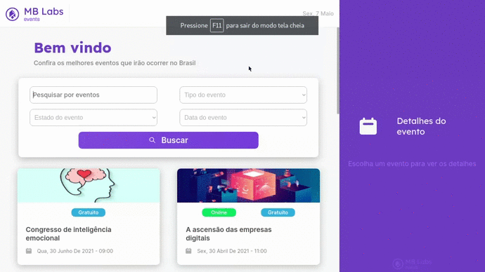

<h3 align="center">
    
    <br><br>
    <b>MB LABS EVENTS</b>
    <br>
</h3>

# Índice

- [Método de implantação](#implantacao)
- [Tecnologias Utilizadas](#tecnologias-utilizadas)
- [Resultados](#resultados)
- [Como Usar](#como-usar)
- [Como Contribuir](#como-contribuir)

<a id="implantacao"></a>

## :bookmark: Método de implantação

O projeto teve como objetivo desenvolver um site de eventos, que pode listar eventos por suas características, além disso o usuário tem a opção de ver mais detalhes.

<a id="tecnologias-utilizadas"></a>

## :rocket: Tecnologias Utilizadas

O projeto foi desenvolvido utilizando as seguintes tecnologias

- [Next.js](https://nextjs.org/)
- [ReactJS](https://reactjs.org/)
- [Styled components](https://styled-components.com/)

<a id="resultados"></a>

## :heavy_check_mark: :computer: Resultado Web

<h1 align="center">
    
</h1>

<a id="como-usar"></a>

## :fire: Como usar

- ### **Pré-requisitos**

  - É **necessário** possuir o **[Node.js](https://nodejs.org/en/)** instalado na máquina
  - Também, é **preciso** ter um gerenciador de pacotes seja o **[NPM](https://www.npmjs.com/)** ou **[Yarn](https://yarnpkg.com/)**.

1. Faça um clone :

```sh
  $ git clone https://github.com/lucasfelixc/animescompanyhero
```

2. Executando a Aplicação:

```sh
  # Instale as dependências
  $ npm install or $ yarn

  # Inicie a aplicação web
  $ yarn dev

  # Inicie o json-server
  $ yarn server
```

<a id="como-contribuir"></a>

## :recycle: Como contribuir

- Faça um Fork desse repositório,
- Crie uma branch com a sua feature: `git checkout -b my-feature`
- Commit suas mudanças: `git commit -m 'feat: My new feature'`
- Push a sua branch: `git push origin my-feature`

---

<h4 align="center">
    Feito com 💜 by <a href="https://www.linkedin.com/in/lucasfelixdev/" target="_blank">Lucas Felix</a>
</h4>
